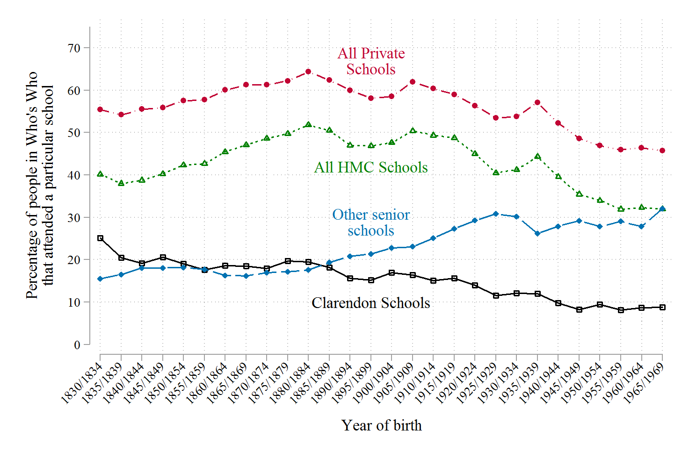
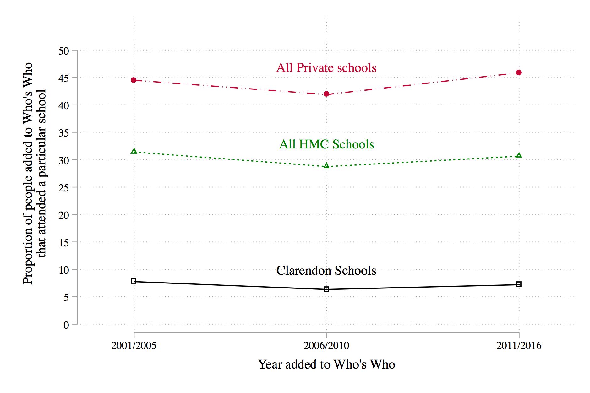
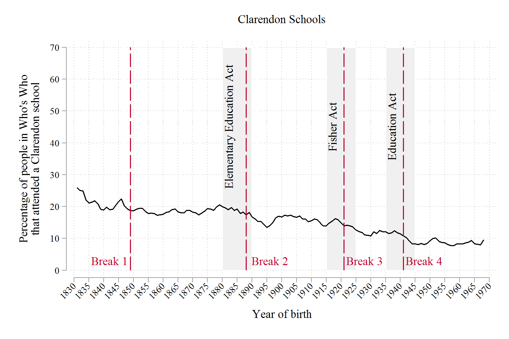

# whoswho

Replication materials for 'The decline and persistence of the Old Boy: Private Schools and Elite Recruitment 1897-2016'.

The raw data used in this analysis are proprietary and so cannot be released. Instead, we share the code used to conduct the analysis so that it can be inspected. 

## Data structure

Each row is a person in Who's Who. Columns are variables, such as the school or university attended by the person included. Most of the analysis is conduct by birth cohort. For example, we are interested in the proportion of people in Who's Who that attended a Clarendon school and who were born between 1830 and 1834. The analysis has been conducted in STATA v.14 and in R. 

## Main analysis

First we examine the time trends for each educational category using an OLS regression model and time dummies.


```
qui reg public i.birth5 if birth5>1 & birth5<30
margins birth5, post

qui reg clarendon_v2 i.birth5 if birth5>1 & birth5<30
margins birth5, post
	
qui reg independent_v2 i.birth5 if birth5>1 & birth5<30
margins birth5, post
		
qui reg other_senior i.birth5 if birth5>1 & birth5<30
margins birth5, post
```


We export the data, multiply the point estimates by 100 (to push them onto percentage point scale), and redraw the graph as a simple line plot. 

```
twoway (line clarendon100 time) (scatter clarendon100 time, mcolor(black)) ///
	(line public100 time, lcolor(green)) (scatter public100 time, mcolor(green)) ///
	(line independent100 time, lcolor(cranberry)) ///
  	(scatter independent100 time, mcolor(cranberry) msymbol(O)) ///
	(line other100 time) (scatter other100 time, mcolor(sea) ) , xlabel(1(1)28, value angle(45)) ///
	ylabel(0(10)75) legend(off) text(67 14 "All Private" "Schools", color(cranberry))  ///
	text(42 14 "All HMC Schools", color(green)) ///
	text(10 14 "Clarendon Schools", color(black)) ///
	text(29 14 "Other senior" "schools", color(sea)) xtitle(Year of birth) ///
	ytitle("Percentage of people in Who's Who" "that attended a particular school") 
```


**Figure 1: Who’s Who entrants by school type, 1830-1969 cohorts**




Next, we conduct a similar analysis but now we look only at the year in which people were added to Who's Who rather than the year in which they were born.


```
reg public i.first5  if  birth5>1 & birth5<30
margins first5, post

reg clarendon_v2 i.first5  if birth5>1 & birth5<30
margins first5, post

reg independent_v2 i.first5 if  birth5>1 & birth5<30
margins first5, post
```

Again, we export the point estimates, multiply by 100, and plot. 

```
twoway (line clarendon100 time) (scatter clarendon100 time, mcolor(black)) ///
	(line public100 time, lcolor(green)) (scatter public100 time, mcolor(green)) ///
	(line independent100 time, lcolor(cranberry)) ///
	(scatter independent100 time, mcolor(cranberry) msymbol(O)) ///
	if time>3, xlabel(4(1)6, value ) xscale(range(3.75 6.25)) yscale(range(0 55)) ///
	ylabel(0(5)50) legend(off) text(67 14 "All Independent" "Schools", color(cranberry))  ///
	text(33 5 "All HMC Schools", color(green)) ///
	text(10 5 "Clarendon Schools", color(black)) ///
	text(47 5 "All Private schools", color(cranberry)) xtitle(Year added to Who's Who) ///
	ytitle("Proportion of people added to Who's Who" "that attended a particular school") 

```

**Figure 4: The persistence of old boys in Who’s Who, 2001-2016** 




## Structural break tests in R

These time series plots allow us to narratively explore changes in elite recruitment. To formally assess whether there are changes in the composition of Who’s Who between cohorts, we estimate structural break models for each school type (where a structural break represents a durable shift in the data generating process of a time series). We use annual data (140 observations) with a 3-year moving average to estimate these models. 

We use the [strucchange](https://cran.r-project.org/web/packages/strucchange/strucchange.pdf) package in R to conduct the analysis. 

```
clar <- as.ts(d1$clarendon_ma, frequency = 1, start =1831)
is.ts(clar)
clar <- ts(clar, frequency = 1, start =1830)
plot(clar)
bp.clar <- breakpoints(clar ~ 1)
summary(bp.clar)
plot(bp.clar)
breakpoints(bp.clar)
```

We repeat the analysis for each school type and once we have identified the breaks we redraw the graphs in STATA. Below is graph for the Clarendon schools only. The process is the same for each school type. 

```
gen max_clar = 70	
twoway (area max_clar year if year>1879 & year<1891, fcolor(gs14) fintensity(*.6) lcolor(white))   ///
	(area max_clar year if year>1914 & year<1926, fcolor(gs14) fintensity(*.6) lcolor(white))   ///
	(area max_clar year if year>1934 & year<1946, fcolor(gs14) fintensity(*.6) lcolor(white))   ///
	(tsline clarendon_ma, lpatt(solid) lcolor(black))(pci 0 1888 70 1888, lcolor(cranberry) lpatt(longdash))	///
	(pci 0 1849 70 1849, lcolor(cranberry) lpatt(longdash)) (pci 0 1921 70 1921, lcolor(cranberry) lpatt(longdash)) ///
	(pci 0 1941 70 1941, lcolor(cranberry) lpatt(longdash)), ylabel(0(10)70) xlabel(1830(5)1970, angle(45)) legend(off) ///
	xtitle(Year of birth) ytitle("Percentage of people in Who's Who" "that attended a Clarendon school") ///
	text(45 1882 "Elementary Education Act", orientation(vertical)) ///
	text(45 1917 "Fisher Act", orientation(vertical)) ///
	text(45 1937 "Education Act", orientation(vertical)) text(3 1842 "Break 1", color(cranberry)) ///	
	text(3 1896 "Break 2", color(cranberry)) text(3 1928 "Break 3", color(cranberry)) ///
	text(3 1948 "Break 4", color(cranberry)) title("Clarendon Schools" " ") 

```


**Figure 3: Structural break tests and educational reform (Clarendon schools).**





In the final stage of the analysis we estimated a simple time series regression model to explore whether four proxies for educational reform were correlated with the proportion of people in Who's Who attending a particular school given they were born in a particular cohort. The four proxies are:
* The proportion of government spending on education (% GDP) when any given cohort were aged 10
* The proportion of the adult population without any formal schooling when any given cohort were aged 35
* The number of children enrolled in school when any given cohort were aged 10 (as a proportion of children aged 0-14)
* The number of people attending university when any given cohort were aged 20 (as a proportion of the population aged 15-24).

```
newey clarendon100 Leduc_GDPpc_at10 empire_size_at35_new banknote_gdp defence_GDPpc_at20  finan_surp_GDPpc_at35 , lag(2) 
newey clarendon100 Lno_school_at35 empire_size_at35_new banknote_gdp defence_GDPpc_at20  finan_surp_GDPpc_at35 , lag(2) 
newey clarendon100 Lstudents_pop_014 empire_size_at35_new banknote_gdp defence_GDPpc_at20 finan_surp_GDPpc_at35 , lag(2)
newey clarendon100 Luni_pop_1524 empire_size_at35_new banknote_gdp defence_GDPpc_at20 finan_surp_GDPpc_at35 , lag(2)
```

Each model was estimated using Newey-West standard errors were we assuming two autocorrelated lags.
